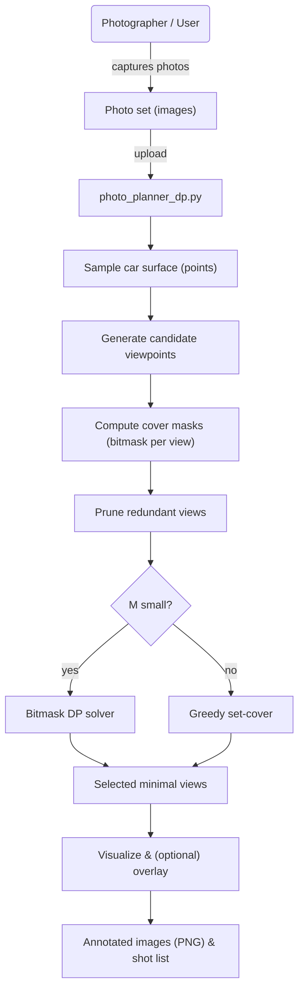
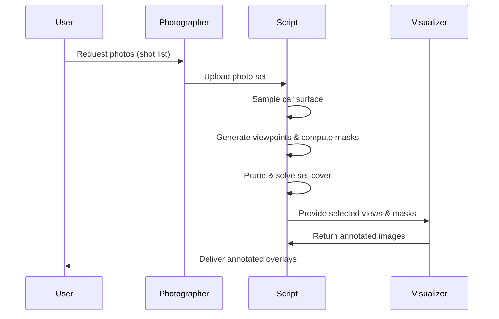

# Photo Planner (DP & Greedy) — README

This repository contains a simple photo-planning demo that computes a minimal set of camera viewpoints to cover sampled regions on a car. It also includes tools to synthesize damaged regions and overlay them onto photos for visualization.

Files
- `photo_planner_dp.py` — main script: sampling, viewpoint generation, coverage computation, exact DP solver (bitmask), greedy fallback, pruning and visualization. CLI included.
- `generate_demo_damaged_interior.py` — helper to generate photographic-style demo images with simulated damage (multiple variants).

Quick summary of algorithms

- Surface sampling
  - The car is represented as a bounding box and points are sampled on its six faces. These sampled points are the "regions" to be covered by photos.

- Viewpoint generation
  - Candidate camera positions are generated by sampling azimuth angles, distances, and heights around the car. Each candidate yields a camera position and forward vector.

- Coverage computation
  - For each candidate view, compute which sampled points fall inside the camera's viewing cone (angle test using field-of-view and distance). The result is a bitmask per view.
  - Occlusion (raycasting) is NOT modeled in this demo — only angular and distance visibility is used.

- Pruning
  - Views whose coverage mask is a strict subset of another view are removed to reduce solver work.

- Set-cover solvers
  - Exact: Bitmask dynamic programming over region-masks. Works when number of regions M is small (default <= 20). Complexity: O(2^M * V).
  - Greedy: Iteratively pick the view covering the most yet-uncovered points. Fast and scalable; standard approximation for set cover (approx O(log M) factor).

Libraries used
- Python standard library (`math`, `itertools`, `argparse`, etc.)
- `matplotlib` — for visualization and synthetic damage image creation (plots and PNGs). Installed in the workspace venv.
- `Pillow` (PIL) — used by the demo image generator; also commonly used for blending/overlay work.
- (Optional) `opencv-python` — recommended if you want robust homography computation and warping when overlaying masks onto real photos.

How to run (examples)

Generate planner visuals and synthetic damage image:

```bash
"/Users/krithipriya/Desktop/GIT/insurance accident/.venv/bin/python" \
  "/Users/krithipriya/Desktop/GIT/insurance accident/photo_planner_dp.py" \
  --show-plot --synthetic-damage front,left,roof --output-prefix synth --annotate
```

Generate photographic demo images:

```bash
"/Users/krithipriya/Desktop/GIT/insurance accident/.venv/bin/python" \
  "/Users/krithipriya/Desktop/GIT/insurance accident/generate_demo_damaged_interior.py"
```

Overlay workflow (manual vs auto)
- Manual (accurate): provide a photo plus at least four corresponding points (schematic -> photo). The script computes a homography and warps the synthetic damage mask into photo coordinates, then blends/redlines the overlay.
- Auto (approximate): the script scales/centers the synthetic mask onto the photo for quick preview (not geometrically exact).

Mermaid diagrams

Flowchart (high-level pipeline):



Sequence diagram (interaction):



Simple diagram: overlaying synthetic mask onto a photo

```mermaid
flowchart LR
  SyntheticMask[synthetic mask (PNG)] --> Homography[compute homography]
  Photo[photo.jpg] --> Warp[warp mask to photo]
  Homography --> Warp
  Warp --> Blend[blend/overlay & annotate]
  Blend --> Output[annotated_photo.png]
```

Recommended photo capture checklist (short)
- 8 full-car photos around vehicle (~every 45°) at ~3–5 m
- Close-ups of each panel, bumpers, wheels, lights, roof
- Use rear/main camera, avoid harsh shadows, include a ruler/coin for scale
- Keep originals and use consistent naming (YYYYMMDD_plate_area.jpg)

Next steps / recommendations
- If you want accurate overlays, collect 4–6 correspondences mapping schematic points to photo pixels (I can help compute and validate them).
- Install `opencv-python` for robust homography and warp features if you plan to overlay real photos frequently:

```bash
.venv/bin/python -m pip install opencv-python
```

License & notes
- This demo is for educational/prototyping use — occlusion, real geometry, and production-level calibration are not implemented.

---

If you want, I can now:
- Merge demo generator into the main script, or keep separate files (current state).
- Add CLI flags to `photo_planner_dp.py` to run overlay operations directly (auto/manual).
- Produce a printable one-page checklist PDF for photographers.

README saved as `README.md` in the repository root.
